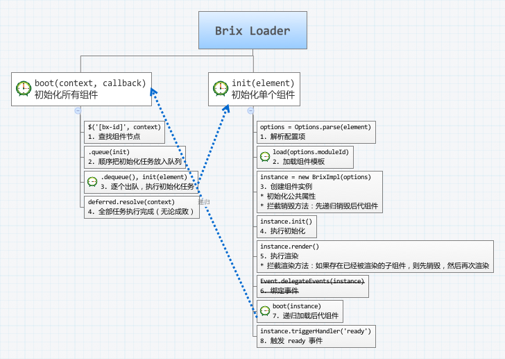

# Brix Loader

## 文前

这篇文章主要整理别对 Brix Loader 的理解、设计时的推理，以及对实现方式的权衡，大部分的思考和内容来自 Brix Core 3.4.5 的实现和团队讨论。

在开始之前，先快速简要的约定几个基础概念 & 术语：

\# | 概念 & 术语                      | 描述
-- | ------------------------------  | ----------------------------------------------------------------------------------------------
1  | **Brix Loader**                 | 负责管理 Brix Component 的整个生命周期，包括加载、初始化、渲染、销毁。
2  | **Brix Component Definition**   | Brix 组件定义规范，符合该规范的组件（或模块），都可以被 Brix Loader 管理和加载。
3  | **Brix Component Base**         | Brix Component Definition 的最简实现。在编写 Brix Component Implement 时，建议从继承该实现开始。
4  | **Brix Component**              | 通指 Brix Component Implement 和 Brix Component Instance。
5  | **Brix Component Implement**    | 符合 Brix Component Definition 的组件。
6  | **Brix Component Instance**     | Brix Component Implement 的实例。

<!-- 
| 中文字幕           
| ----------------- 
| Brix 加载器       
| Brix 组件定义规范  
| Brix 组件基类     
| Brix 组件         
| Brix 组件实现      
| Brix 组件实例      
 -->

## 可以用 140 个字概述这篇文章吗？

*TODO*

## 关注点

从组成结构看，一个 Brix Component 会需要关联的节点 element、数据 data、模板 template、配置项 Options 和事件 events。

从生命周期看，一个 Brix Component 会被解析、加载、初始化、渲染和销毁，它的 Brix Child Components 也需要同样的处理。

而为了自动化地、默默地、透明地管理 Brix Component，则必须采取集中管理的机制：为 Brix Component 提供所有必需的组成元素，并在合适的时机——某个生命周期阶段——调用合适的方法。而且，Brix Component 必须要遵循一致的规范，才有可能实施这种集中管理。

以上这些，正是 Brix Loader 所应该关注的。

然后在开始编码之后，就很快发现上面的穷举和推导仍然远远不够，实施起来的难度要比想象的复杂很多：

1. 节点 element 可能会发生变化，此时需要对 Brix Component 的状态和渲染后的 DOM 结构进行同步更新，甚至可能需要非常复杂的局部重新渲染，这又涉及到模板 template 的选型和解析。例如，Dropdown 关联的 select 节点的值正在被修改，Pagination 的分页大小正在被修改。
2. 节点 element 可能被作为容器节点（例如 Pagination），也可以被作为触发节点（例如 ColorPicker）。
3. 数据 data 往往会发生变化，所需要的处理同第 1 条。

事实上，坑实在太多太多：在 Brix Component 生命周期的每个环节，当组成元素发生变化时，当存在 Brix Child Components 时，当需要局部渲染时，当某个环节是异步时，当某个环节出现异常时，当所有变化交叉在一起时。。。

就像电子表格 VisiCalc 使 PC 如超级赛亚人般变身为商业工具一样，当我用表格把所有关注点穷举出来，将错综庞杂的关系抽丝剥茧之后，对 Brix Loader 的设计思路豁然开朗，现在，需要解决不过是一个个的小问题了：

<table>
    <tr>
        <td colspan="2" rowspan="3"><stong>关注点<!-- Concerns --></stong></td>
        <td colspan="13">Brix Component</td>
    </tr>
    <tr>
        <td colspan="2">Implement</td>
        <td colspan="4">Instance</td>
        <td colspan="3">配置项 options</td>
        <td colspan="4">事件 events</td>
    </tr>
    <tr>
        <td>解析</td> <td>加载</td> <td>初始化</td> <td>渲染</td> <td>销毁</td> <td>嵌套</td>
        <td>解析</td> <td>初始化</td> <td>改变</td>
        <td>初始化</td> <td>响应</td> <td>销毁</td> <td>嵌套</td>
    </tr>
    <tr>
        <td rowspan="3">Brix Loader</td>
        <td>首次渲染</td>
        <td>√</td> <td>√</td> <td>√</td> <td>√</td> <td>√</td> <td>√</td>
        <td>√</td> <td>√</td> <td>√</td>
        <td>√</td> <td>√</td> <td>√</td> <td>√</td>
    </tr>
    <tr>
        <td>局部变化</td>
        <td>-</td> <td>-</td> <td>-</td> <td>-</td> <td>-</td> <td>-</td>
        <td>-</td> <td>-</td> <td>-</td>
        <td>-</td> <td>-</td> <td>-</td> <td>-</td>
    </tr>
    <tr>
        <td>再次渲染</td>
        <td>√</td> <td>√</td> <td>√</td> <td>√</td> <td>√</td> <td>√</td>
        <td>√</td> <td>√</td> <td>√</td>
        <td>√</td> <td>√</td> <td>√</td> <td>√</td>
    </tr>
</tbody></table>

## 源码解析

### loader.js

### brix.js

### query.js

* `Query( selector [, context ] )`
* `Query( element )`

接收一个 CSS 选择器表达式，用于匹配一组 DOM 元素，然后返回这些 DOM 元素所关联的 Brix 组件。

该方法的返回值是一个“伪数组”，包含了一组 Brix 组件，“伪数组”上含有所有 Brix 组件的方法。

### event.js

### 其他

1. Brix Core 3.4.5 引入了 Promise，在这个版本里有什么变化吗？

    参考 loader.js。在阅读 3.4.5 的实现方式和试着沿用时，总是被层层嵌套的 Promise 搞晕。所以，我把每个环节重新分为可能需要异步的任务和需要顺序执行的任务。分别用 Promise 和 Queue 来实现。在上面 loader.js 的初始化流程图中，用钟表标识的是异步任务，返回一个 promise 对象。

2. Brix Core 3.4.5 和之前的 2.0 不会默认载入 CSS 文件，在项目中应用时需要手动敲入 CSS 依赖，很不方便，这次有什么变化吗？

    之前没有考虑默认载入 CSS 文件的原因是，在项目中很可能会需要重写样式。这次（待实现）建议增加一个配置项 `{ css: 'path/name.css' }`：在初始化时，如果没有找到这个配置项，就载入默认 CSS 文件，如果指定了，则载入重新的 CSS 文件。

3. `Query( selector [, context ] )` 返回的 Brix Component Instance 集合，该如何使用？

    见 query.js。在 `Query( selector [, context ] )` 内部，会收集找到的组件的方法，并绑定至返回值上。

    接下来，会把 `Query( selector [, context ] )` 改为 `Brix( selector [, context ] )`，`Loader.boot()` 支持 CSS 选择器表达式。最终，对外只暴漏 Loader 和 Brix 两个对象。

4. 关于局部渲染有什么变化吗？

    见前面的表格，局部渲染是至关重要必须引入的一环，如果没有，就需要 Brix Component Implement 自己做很多的处理。在选型上，Brix Core 3.4.5 曾经斟酌过字符串模板和 DOM 模板，字符串模板解析和渲染非常复杂，比如依赖特定的模板引擎和对应的双向绑定工具，DOM 模板的实现则简单的多，所以建议采用 DOM 模板。

    实现局部渲染之后，可以在 在 Loader 中，拦截 Brix Component 的 `.init()`、`.render()` 方法，这样，Brix Core 3.4.5 中的 `Brix.boot()` 就可以取消掉。

5. 是否会强依赖 KISSY 以及 KISSY 的 Promise、XTemplate、Rich Base 等等。

    只会兼容 KISSY 的模块加载器。KISSY 在不断的完善，但是在项目开发中的友好度不够，所以在每个环节的选型时，在以物竞天择的机制，选择更开放、更友好的库。

6. 到底什么能搞完啊！！！
    
    目前支持业务还是占去了大部分时间，争取 9 月底把上面表格中的关注点开发完。

## 扩展阅读

*TODO*